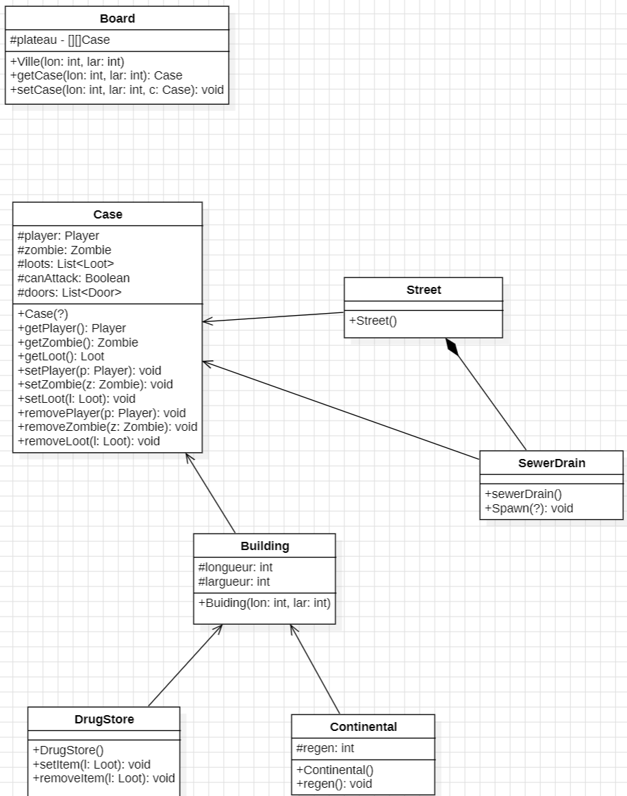
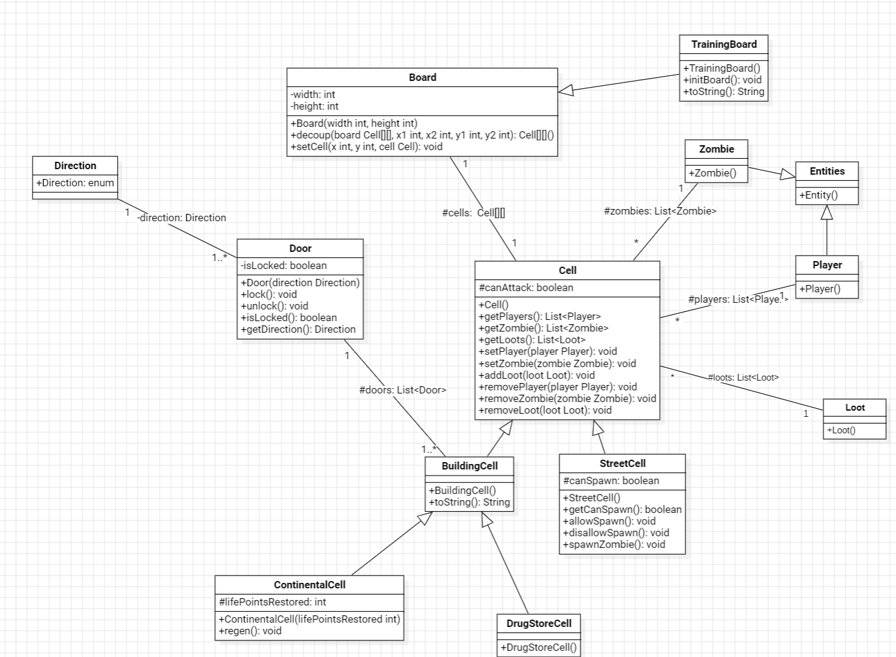

# l2s4-projet-2024

Vous devez *forker* ce projet dans votre espace de travail Gitlab (bouton `Fork`) et vidéo sur le [portail](https://www.fil.univ-lille.fr/portail/index.php?dipl=L&sem=S4&ue=Projet&label=Documents)
Un unique fork doit être réalisé par équipe.

Une fois cela réalisé, supprimer ces premières lignes et remplissez les noms des membres de votre équipe.
N'oubliez pas d'ajouter les autres membres de votre équipe aux membres du projet, ainsi que votre enseignant·e (statut Maintainer).

# Equipe

- Ali KERBOUS
- Duc NGUYEN
- Mazen KALAKECH
- Stéphane  BOUDIER

# Sujet

[Le sujet 2024](https://www.fil.univ-lille.fr/~varre/portail/l2s4-projet/sujet2024.pdf)

# Livrables

## Livrable 1

### Atteinte des objectifs

### Difficultés restant à résoudre

## Livrable 2

### Atteinte des objectifs

### Difficultés restant à résoudre

## Livrable 3

### Atteinte des objectifs

### Difficultés restant à résoudre

## Livrable 4

### Atteinte des objectifs

### Difficultés restant à résoudre

# Journal de bord

## Semaine 1

Lors de cette première semaine nous avons réfléchi à l'implémentation du plateau et des cases pour en arriver à cette version (non définitif) : 

Nous réfléchissons à l'implémentation des portes et avons deux approches :
1. générer quatre portes dans chaque salle puis faire correspondre les portes adjacentes. Selon on l'on veut se déplacer ("nord", "sud", "est", "ouest") on vérifie la case correspondante en lui donnant une variable `room` (si c'est une salle) et `null` (si elle n'existe pas / c'est un bord). Donc pour un immeuble de taille $n\times m$, nous avons : $n\times m \times 4$ portes.
2. Crée une classe `Door` ayant deux attributs `caseA` `caseB` étant des pièces (les deux pièces séparant la porte), et un booléen `isOpen`. Lors de la création d'une case on peut imaginer une méthode `addDoor(c neighbourCase)`

## Semaine 2

### Notes de la seconde séance de projet

#### Implémentation des cases 

##### 1. La classe `Building`
Il faut oublier l'idée des classes `drugstore` et `Continental` héritant de la classe building car cela posse un problème lors de la création, en effet les pièces étant dans un immeuble mais n'ayant rien de spécial ne peuvent pas être représenté. Nous faisons donc le chois d'avoir trois classes `DrugStore` `Continental` et `Building` représentant des pièces et héritant de la classe  `Case`.
On oublie donc les attributs `longueur` et `largeur` pour la classe building 
##### 2. Les portes
Nous avons pris le choix de générer quatre portes de classe `Door` pour chaque pièce (`Building`, `DrugStore` et `Continental`) cela rend l'implémentation plus simple et ne crée pas de porte entre les routes. Lorsque on essaye de passer d'une pièce a l'autre on utilisera les points cardinaux (NORD, SUD, EST, OUEST) et lorsque l'on veut passer de la porte A vers B : A -> B Il faudra donc vérifier la porte Est de A puis la porte Ouest de B Ce qui nous donne les quartes tuples suivants :
- Nord - Sud
- Sud - Nord
- Est - Ouest
- Ouest - Est
##### 3. Le cas SewerDrain
Pour la bouche d'égouts nous supprimons la classe `SewerDrain` et optons sur un booléen `canSpawn` présent dans la classe `Street` permettant de savoir si une case représentant une rue peut ou non faire apparaître des zombie, si oui la classe utilisera la méthode `Spawn()` permettant de faire apparaître des zombie, l'affichage de la case en sera impactée.
##### 4. L'affichage
Pour l'affichage nous réfléchissons a une implémentation du style `public static final char y = ~~~` que l'on pourra appeler a chaque fois que la case x et de type y.
#### Algorithme de création du plateau 

##### Comment défini t-on un plateau ?
Le plateau est composée de route et d'immeuble dont voici les contraintes :
- Une route est forcément de largeur 1
- Les deux première route vont d'un bord a l'autre en se croisant
- Les immeubles sont de taille minimum $2\times 2$ et max ?
- Les routes ne peuvent pas longer les bords
- Les immeubles ne peuvent pas longer les bords
- Deux immeubles distinct ne sont forcément séparé par une route
##### Comment le crée ?
Pour les deux premières routes nous savons que pour un plateau de taille $n\times m$ nous avons la première route qui part de la case $(i, 0)\text{ avec } 2\leq i\leq n-2$ jusqu'à la case $(i, m)$. Il en va de même pour la deuxième route qui part de la case $(0, j) \text{ avec } 2 \leq j \leq m-2$ jusqu'à $(n,j)$ 

Il nous semble logique de crée les routes puis de définir comme immeuble tous ce qui n'est pas une route.

## Semaine 3

Lors de cette séance nous avons revu la conception expliqué lors de la semaine 2. La case Building (maintenant appelé `BuildingCell`) est de nouveau d'actualité. En effet cette classe est devenue une case building simple et les case continental et drug store (respectivement `ContinentalCell` et `DrugStoreCell`) héritent de nouveau de Building. 

Nous nous somme concentré sur l'algorithme de création de plateau avec, dans un premier temps, l'affichage du TrainingBoard qui semble plus simple car posséde des cases prédéfinie. Nous nous sommes rendu compte d'un problème majeurs : comment afficher le plateau. Actuellement deux idées s'offre a nous :
1. Afficher ligne par ligne 
2. Afficher cases pasr cases

Dans un premier temps il nous fallait savoir si l'on faisait une méthode `toString()` dans la classe building qui vérifiant le type de la casses et agissait en consécance ou si l'on métait des méthode `toString()` au sein de chaque classes Cell qui va donc gérer lui même l'affichage de sa case. Nous avons finalement otpé pour la deuxième solution, qui nous semble plus lisible et abordable.

Voici le diagramme UML a la fin de cette séance :

## Semaine 4

## Semaine 5

## Semaine 6

## Semaine 7

## Semaine 8

## Semaine 9

## Semaine 10

## Semaine 11

## Semaine 12
